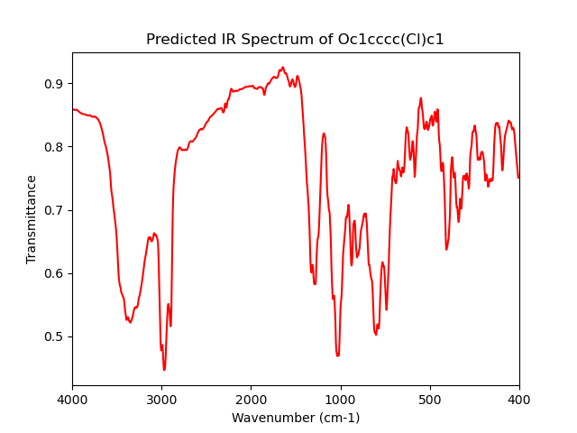

# IR Spectra Predictor using Graph Neural Networks

This project predicts IR spectra from molecular graphs using Graph Neural Networks (GNNs) specifically GATs. It includes all the necessary code for graph processing, such as node and edge feature extraction. The project was trained on a large dataset of molecular graphs and their corresponding IR spectra.

**Note:** The training data and models are not included in this repository due to data and licensing restrictions.

## Graph Representation


The molecular graphs are represented using nodes and edges, where nodes represent atoms and edges represent bonds. Each node and edge is associated with a feature vector that encodes relevant chemical properties.
## Example IR spectrum
<div style="display: flex;">
  
  
</div>
Above is an example prediction of benzyl alcohol and Heptance showing some correct peak information and create a realistic IR spectrum for both.

## Installation
```bash
# Clone the repository
git clone https://github.com/lewmas1/GraphtoIR.git

# Change directory to the project folder
cd GraphtoIR

# Install dependencies (if applicable)
pip install -r requirements.txt
```

## Usage
### Data processing
`data_processing.py` contains functions for processing smiles strings into molecular graphs as well as combining them with there assoctiated spectra and saving as a .pkl file used for training.

### Training

Train the model by running the `train.py` script which requires the .pkl created by `data_processing.py`.

Once training is complete it should save the model as `model.pt`.

### Testing

Testing the model can be done by running `test.py` which requires a smiles string which will create a matplotlib plot of the predicited IR spectrum.

## License
[MIT](https://choosealicense.com/licenses/mit/)

## Authors
lewmas1